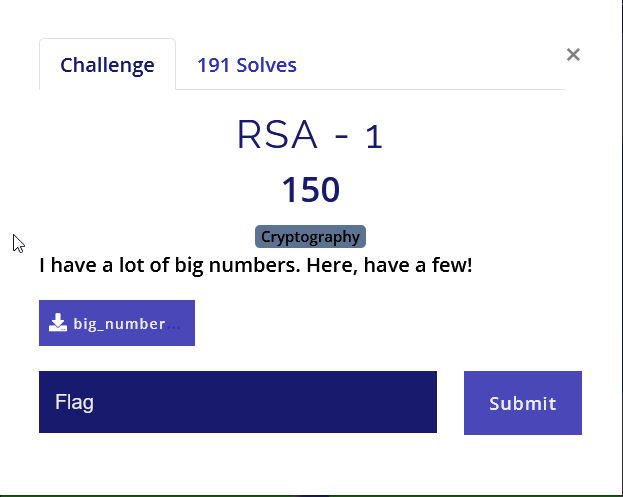
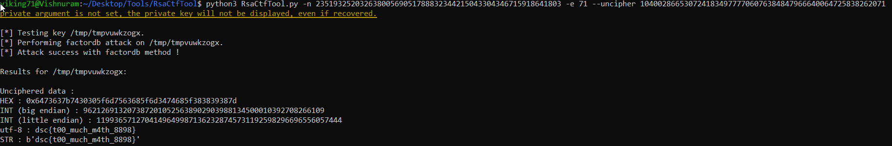

# RSA-1


## Solution

The given file(big_numbers.txt) contains value of c, n and e

cyphertext = 10400286653072418349777706076384847966640064725838262071
n = 23519325203263800569051788832344215043304346715918641803
e = 71

We use RsaCtfTool to crack this cybertext.

```bash
python3 RsaCtfTool.py -n 23519325203263800569051788832344215043304346715918641803 -e 71 --uncipher 10400286653072418349777706076384847966640064725838262071
```


Flag: dsc{t00_much_m4th_8898}
