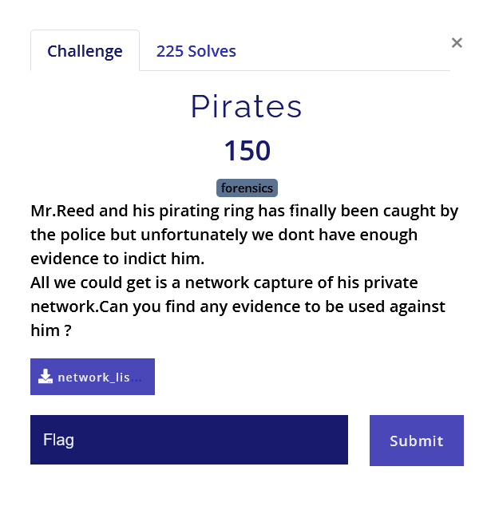
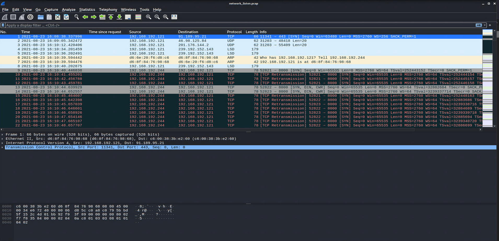
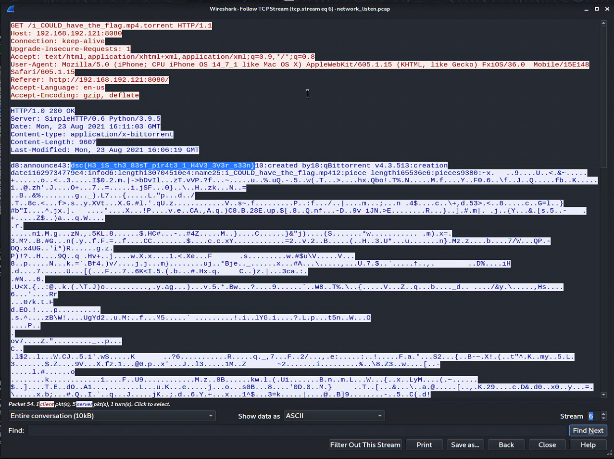

#Solution
The given file is pcap file which will contain the packet capture of the private network.

Using the Wireshark we can analyse the file.

After opening it in wireshark, I followed the TCP stream to look for susipicious strings. (Analyze -> Follow -> TCP Stream)

Stream number 6 contains the flag.

Flag: dsc{H3_1S_th3_83sT_p1r4t3_1_H4V3_3V3r_s33n}